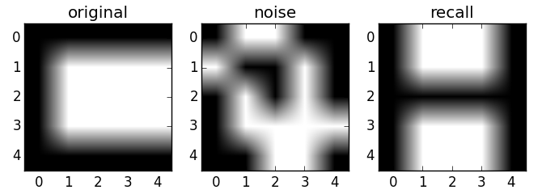
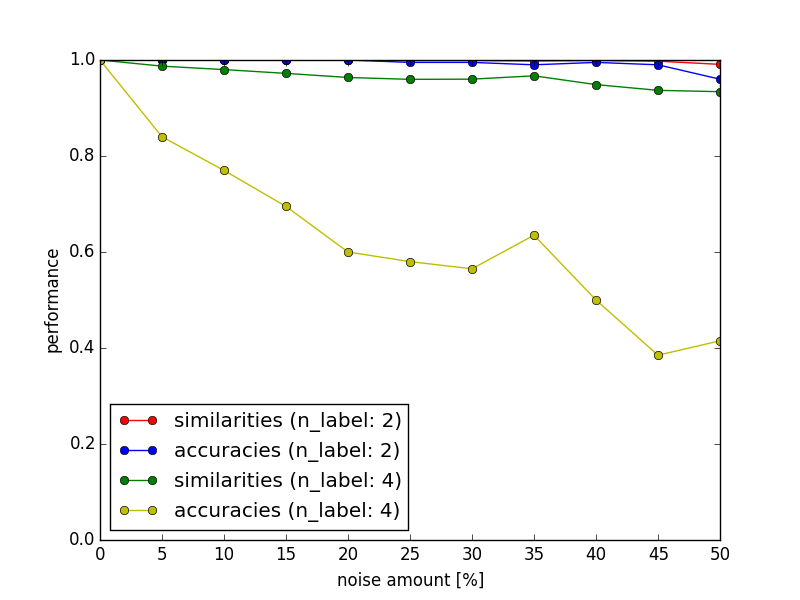

===============================
Intelligent_Mechano_Informatics
===============================

How to Run
==========
.. code-block:: sh

    # simple fit and recall
    $ python hopfield_single_performance.py
    # plot performances of recalling with two label memory
    $ python hopfield_two_label_performance.py
    # plot performances of recalling with multi label memory
    $ python hopfield_labels_performance.py
    # plot performances of recalling with noise for 2, 4 label memory
    $ python hopfield_noise_performance.py

Result
======

``hopfield_single_performance.py``
--------------------------------
Below is sample image of ``hopfield_single_performance.py`` under ``noise_amount=0.5`` and ``n_label=2``.

accurate:

.. image:: sample_image/label2_noise0.5_accurate.png

wrong:

``hopfield_two_label_performance.py``
-------------------------------------
Below is performances of each combination of two labels.

.. image:: sample_image/two_label_performance.png

``hopfield_labels_performance.py``
-------------------------------------
Below is graph of performances of 2 - 6 labels memory.

.. image:: sample_image/labels_performance.png

``hopfield_noise_performance.py``
-------------------------------------
Below is graph of performances with 5 - 50% noise.

Report
======
`Download Report <https://github.com/wkentaro/inbox/raw/master/Intelligent_Machano_Informatics/kuniyoshi/report/03140299_kentaro_wada.pdf>`_
